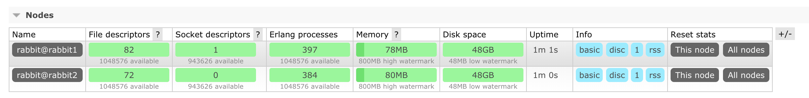

[](https://travis-ci.org/mmornati/docker-rabbitmq-cluster)[](https://microbadger.com/images/mmornati/docker-rabbitmq-cluster "Get your own image badge on microbadger.com")[](https://microbadger.com/images/mmornati/docker-rabbitmq-cluster "Get your own version badge on microbadger.com")

Docker images to run RabbitMQ cluster. It extends the official image with a rabbitmq-cluster script that does the magic.

The image is actually based on `rabbitmq:3.7-management-alpine` (at this moment the available version is the 3.7.8) and it is modified compared to the original to use the tools available on the Alpine linux instead the Debian used for the original version of the project.

# Building

Once you clone the project locally use the following command to build the image:

```
docker build -t mmornati/rabbitmq-cluster .
```

# Running with docker-compose

If you want to run the cluster on one machine use [docker-compose](https://github.com/docker/compose/)

```
docker-compose up -d
```

By default 3 nodes are started up this way:

```
rabbit1:
  image: mmornati/rabbitmq-cluster
  hostname: rabbit1
  environment:
    - ERLANG_COOKIE=abcdefg
  ports:
    - "5672:5672"
    - "15672:15672"
rabbit2:
  image: mmornati/rabbitmq-cluster
  hostname: rabbit2
  links:
    - rabbit1
  environment:
    - ERLANG_COOKIE=abcdefg
    - CLUSTER_WITH=rabbit1
  ports:
    - "5673:5672"
    - "15673:15672"
```

If needed, additional nodes can be added to this file.

Once cluster is up:
* The management console can be accessed at `http://localhost:15672`
* The connection host should look like this: `localhost:5672,localhost:5673,localhost:5674`

# Check the cluster
Cluster information can be found directly on the management console

or using a cli command on one of the node:
```bash
$ docker-compose exec rabbit1 rabbitmqctl cluster_status
Cluster status of node rabbit@rabbit1 ...
[{nodes,[{disc,[rabbit@rabbit1,rabbit@rabbit2]}]},
 {running_nodes,[rabbit@rabbit2,rabbit@rabbit1]},
 {cluster_name,<<"rabbit@rabbit1">>},
 {partitions,[]},
 {alarms,[{rabbit@rabbit2,[]},{rabbit@rabbit1,[]}]}]
```


# Credits

* Inspired by https://github.com/bijukunjummen/docker-rabbitmq-cluster
* Fork from https://github.com/harbur/docker-rabbitmq-cluster

